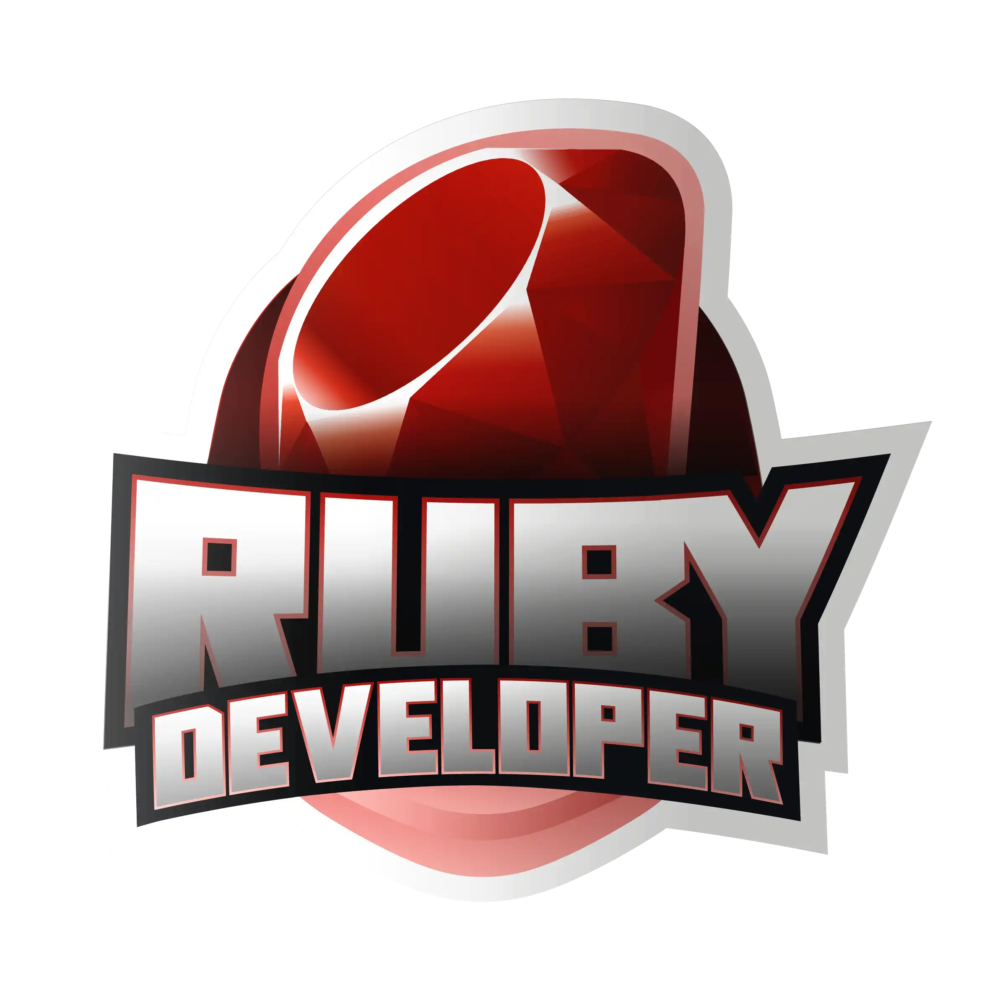

Venha conhecer e se aprofundar nessa linguagem que
foi criada para ser de fácil entendimento, abordagem
simples e transformar a programação em algo funcional.

Em **Ruby**, tudo é um objeto. Cada parcela de informação
e código podem receber as suas próprias propriedades e ações.

Durante a Formação, você irá conhecer o surgimento
dessa linguagem, entender como é fácil criar e
manipular seus códigos, afinal esse foi o propósito
de sua criação, além de ver na prática a POO aplicada a
Ruby, trabalhar com APIs, arquitetura MVC e claro,
conhecer o famoso framework **Ruby on Rails**.

- [x] Conhecendo a Linguagem Ruby
  * [x] Introdução ao Ruby
  * [x] Conceitos de Ruby
  * [x] 1º Projeto com Ruby
  * [x] Estruturas de Controle em Ruby
  * [x] Desafio Básico #1 Formação Ruby
- [] Avançando na Linguagem Ruby
  * [] Coleções em Ruby
  * [] Cálculo com Potência em Ruby
  * [] Métodos em Gems
  * [] Criando programa de consulta CPF
  * [] Desafio Básico #2 Formação Ruby
- [] Programação Orientada a Objetos com Ruby
  * [] Introcução à POO com Ruby
  * [] Modelando um Domínio de Negócios com Ruby
  * [] Desafio #3 Formação Ruby
  * [] Criando uma Dinâmica com POO 
- [] Conhecendo o Ruby on Rails
  * [] Introdução à Arquitetura MVC
  * [] Comandos básicos no Rails
  * [] Criando um blog
- [] Explorando Closures e Expressões Regulares com Ruby
  * [] Closures
  * [] Expressões Regulares
  * [] Qual é o seu Whatsapp?
- [] Primeiros Passos na Comunicação Web em Ruby
  * [] Introdução à comunicação Web em Ruby
  * [] Analizando páginas HTML em Ruby com Biblioteca Nokogiri
  * Avalie a Formação de Ruby Developer